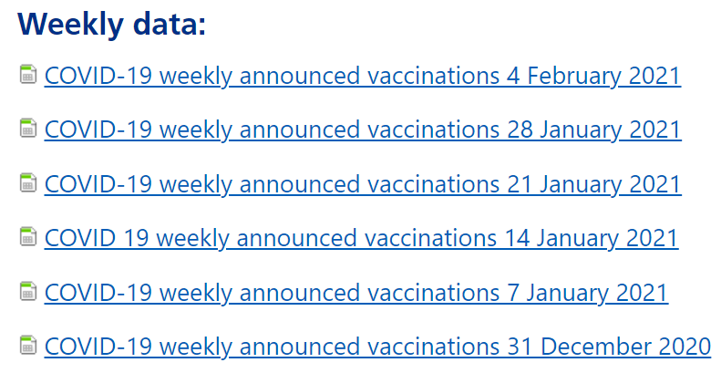
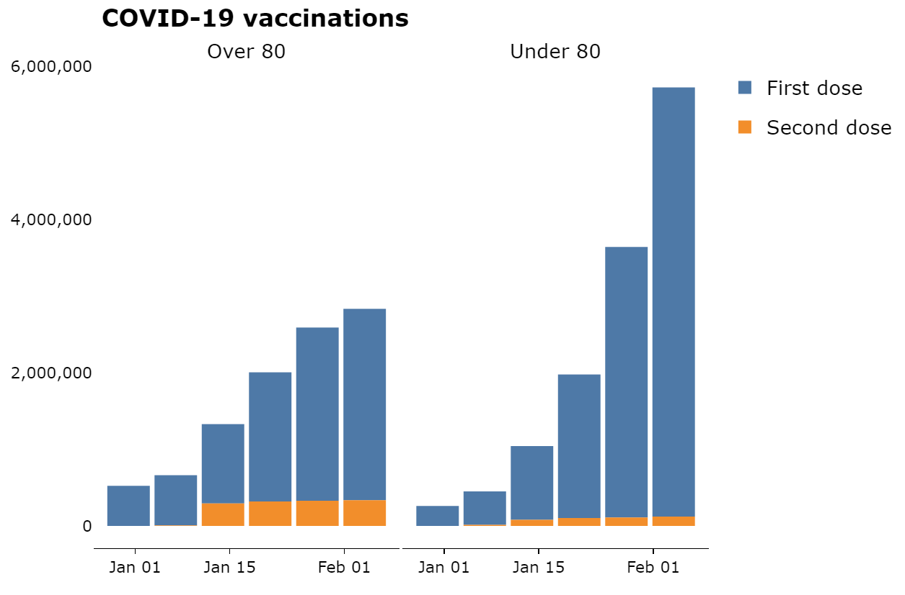

# Pipeline to download, process and visualize open data on COVID-19 vaccinations by NHS England

#### Project Status: In progress

## Project Description and Data Source

The [NHS England](https://www.england.nhs.uk/statistics/statistical-work-areas/covid-19-vaccinations/) dataset contains information on the number of COVID-19 vaccinations provided by the NHS in England, with a new release every week. The code here extracts the most recent data from the website and downloads those files, after checking which files you have already downloaded locally. It also produces a markdown file to visualize key summary statistics.

## How does it work?

- The first file, 'NHSE-vaccinations.R', web-scrapes the [NHS England](https://www.england.nhs.uk/statistics/statistical-work-areas/covid-19-vaccinations/) page and stores the addresses for all the weekly releases (which are in an .xslx format).

- It then checks which files you have already downloaded, so that you only download the most recent files you don't yet have.
- Then, it cleans each weekly release and appends the datasets into a clean dataset which is saved locally. Because each weekly release is different, the code here standardizes it so that week-on-week statistics can be compiled.
- Finally, the 'NHSE-vaccinations-markdown.Rmd' file produces an html markdown file with updated visualizations.
- For example, it tracks the number of weekly COVID-19 vaccinations by age group and dose.

### Requirements

These scripts were written in R version 4.0.2 and RStudio Version 1.1.383. 

The following packages are needed to run the scripts:

- tidyverse
- readxl
- rvest
- curl
- lubridate
- ggthemes
- scales
- plotly

## Authors

* Sebastien Peytrignet - [Twitter](https://twitter.com/SebastienPeytr2) - [GitHub](https://github.com/speytrignet-thf)

## License

This project is licensed under the [MIT License](https://github.com/speytrignet-thf/NHSE-vaccinations-pipeline/blob/main/LICENSE).
